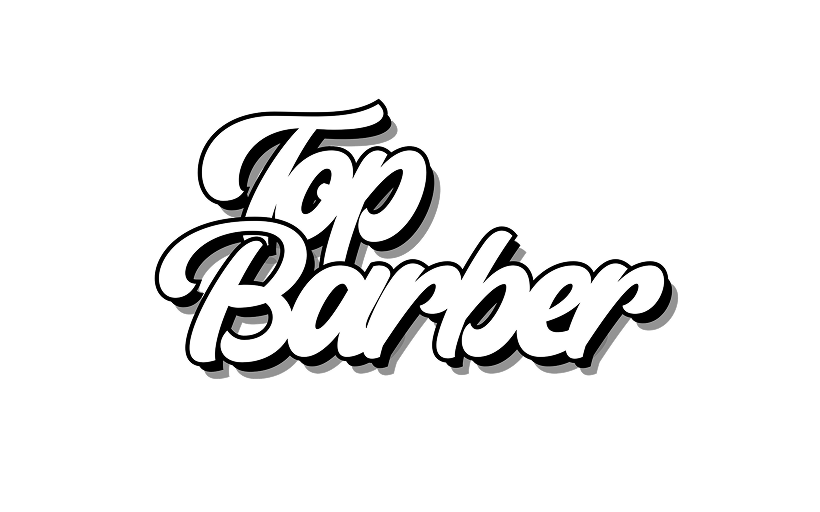

<h1 align="center"> 🌐 Interactive Page </h1>

  An exclusive and free project, developed by me with the help of classes watched on Rocket Seat about WEB technologies.

  <a href="#-about-the-project">About</a>&nbsp;&nbsp;&nbsp;|&nbsp;&nbsp;&nbsp;
  <a href="#-technologies">Technologies</a>&nbsp;&nbsp;&nbsp;|&nbsp;&nbsp;&nbsp;
  <a href="#-layout">Layout</a>&nbsp;&nbsp;&nbsp;|&nbsp;&nbsp;&nbsp;
  <a href="#memo-license">License</a>

  

 

  

> **Note:** This project was developed as a personal exercise to test my skills and learning progress in web development.

## 📌 About the Project

This project was created with the intent to test my learnings in HTML, CSS, and JS. It features the logo of a barbershop that I manage, along with links that lead to illustrative destinations, created specifically to test the page's functionalities.

## 🚀 Technologies

This project was developed with the following technologies:

- HTML & CSS
- JavaScript
- Git & Github
- Figma

## 🔖 Layout

You can view the ORIGINAL project layout that inspired me through [THIS LINK](https://www.figma.com/community/file/1187422022288947321). It is necessary to have an account on [Figma](https://figma.com) to access it.

## 📃 License

This project is under the MIT license. See the [LICENSE](LICENSE) file for more details.

---

  Made with ❤️ by <a href="https://app.rocketseat.com.br/me/gabbrielbf">Gabriel Bastos</a> with the help of Rocket Seat! <a href="https://discord.gg/rocketseat">Join our community!</a>

